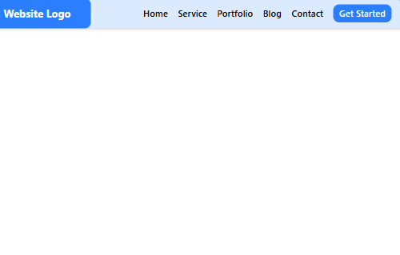
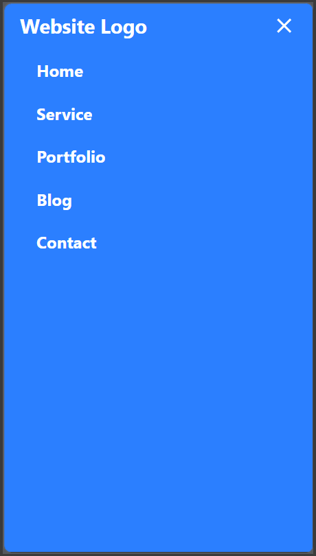

# 📱 Responsive Navbar with Hamburger Menu

> A fully responsive navigation bar built with React and Tailwind CSS, featuring a hamburger menu for mobile devices and a clean desktop navigation experience.

---

## 🎯 Project Overview

This practice focuses on building a modern responsive navigation system that adapts seamlessly across desktop, tablet, and mobile devices.

The project demonstrates responsive design principles, component-based architecture, state management, accessibility best practices, and mobile-first development.

---

## ✨ Features

* ✅ Fully responsive navigation layout
* ✅ Desktop navigation with inline menu items
* ✅ Mobile-friendly hamburger menu
* ✅ Full-screen mobile navigation overlay
* ✅ Smooth menu open/close interactions
* ✅ Reusable React component structure
* ✅ Accessible navigation controls
* ✅ Keyboard-friendly navigation
* ✅ Modern UI built with Tailwind CSS

## 🖼️ Screenshots

### 🖥️ Desktop View


---

### 💻 Tablet View



---

### 📱 Mobile View (Menu Closed)


---

### 📱 Mobile View (Menu Open)



## 🚀 Getting Started

### Install Dependencies

```bash
npm install
```

### Start Development Server

```bash
npm run dev
```

Open:

```text
http://localhost:5173
```

---

## 🧩 Concepts Practiced

### React

* Functional Components
* JSX
* State Management (`useState`)
* Conditional Rendering
* Event Handling

### Responsive Design

* Mobile-First Development
* Responsive Navigation
* Flexbox Layout
* Breakpoint-Based Design

### Accessibility

* `aria-expanded`
* `aria-controls`
* Keyboard Navigation
* Focus Management

---

## 📚 Learning Outcomes

By completing this practice, I learned:

* How responsive navigation systems work
* Managing UI state using React
* Building mobile-friendly interfaces
* Implementing accessible navigation controls
* Creating reusable UI components
* Structuring React projects professionally

---

## 🏁 Practice Information

| Property        | Value                     |
| --------------- | ------------------------- |
| Practice Number | 01                        |
| Difficulty      | 🟢 Easy                   |
| Category        | React.js                  |
| Focus Area      | Responsive UI Development |
| Status          | ✅ Completed               |

---


> Part of the **300-Coding-Practices** journey 🚀
