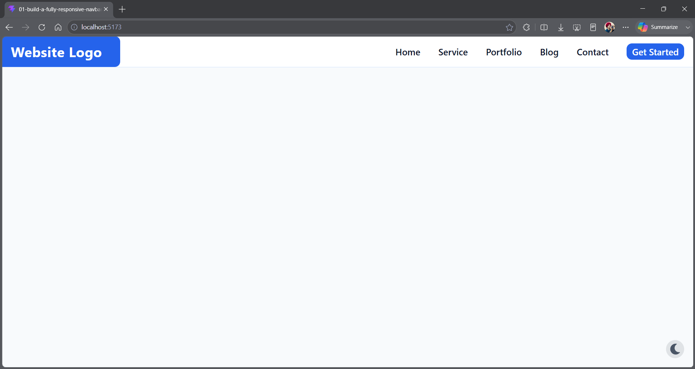
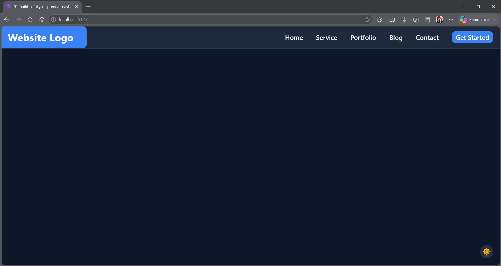

# 🌙 Responsive Navbar with Dark Mode Toggle

> A fully responsive navigation bar built with React and Tailwind CSS featuring a persistent dark/light mode toggle powered by localStorage.

---

## 🎯 Project Overview

This practice focuses on building a responsive navigation system with theme switching capabilities. The selected theme is persisted using localStorage, ensuring the user's preference remains intact even after refreshing or reopening the application.

The project demonstrates state management, localStorage integration, responsive UI development, accessibility best practices, and theme persistence techniques used in modern web applications.

---

## ✨ Features

* ✅ Fully responsive navigation layout
* ✅ Dark / Light mode toggle
* ✅ Theme persistence using localStorage
* ✅ Mobile-friendly hamburger menu
* ✅ Full-screen mobile navigation overlay
* ✅ Smooth UI interactions
* ✅ Accessible navigation controls
* ✅ Keyboard-friendly navigation
* ✅ Tailwind CSS dark mode support

---

## 🖼️ Screenshots

### ☀️ Light Mode



---

### 🌙 Dark Mode



---

## 🚀 Getting Started

### Install Dependencies

```bash
npm install
```

### Start Development Server

```bash
npm run dev
```

Open:

```text
http://localhost:5173
```

---

## 🧩 Concepts Practiced

### React

* Functional Components
* JSX
* State Management (`useState`)
* Side Effects (`useEffect`)
* Event Handling

### Browser APIs

* localStorage
* Theme Persistence
* DOM Manipulation

### Responsive Design

* Mobile-First Development
* Responsive Navigation
* Flexbox Layout
* Breakpoint-Based Design

### Accessibility

* `aria-expanded`
* `aria-controls`
* Keyboard Navigation
* Focus Management

---

## 📚 Learning Outcomes

By completing this practice, I learned:

* How to persist user preferences using localStorage
* Managing application themes with React
* Implementing dark mode using Tailwind CSS
* Building responsive navigation systems
* Creating accessible UI components
* Synchronizing UI state with browser storage

---

## 🏁 Practice Information

| Property        | Value                            |
| --------------- | -------------------------------- |
| Practice Number | 02                               |
| Difficulty      | 🟢 Easy                          |
| Category        | React.js                         |
| Focus Area      | Theme Management & Responsive UI |
| Status          | ✅ Completed                      |

---

## 🔍 Key Implementation Notes

### Theme Persistence

The theme is loaded directly from localStorage during state initialization to prevent UI flashing during page reloads.

### Dark Mode Activation

Tailwind's dark mode classes are controlled by toggling the `dark` class on the root HTML element.

### Dynamic Icon Switching

The theme toggle button updates icons dynamically based on the currently active theme.

---

## 🔄 Future Improvements

* System theme detection
* Multiple color themes
* Theme animation transitions
* Theme context provider
* Theme settings panel

---

> Part of the **300-Coding-Practices** journey 🚀
